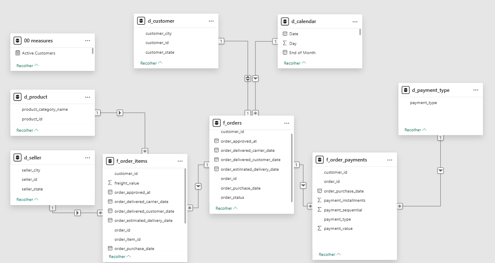
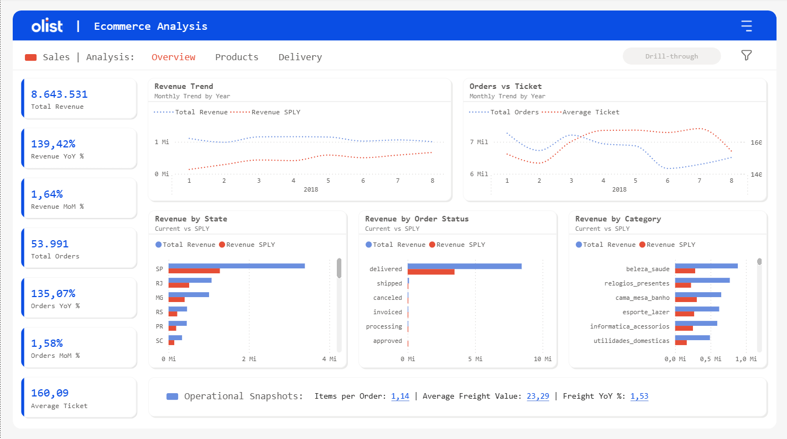

# Olist Analytics Project

This project was developed as a portfolio project to demonstrate end-to-end Business Intelligence and Data Modeling skills using the Brazilian E-commerce dataset by Olist.

The solution includes:
- data ingestion
- dimensional modeling (Star Schema)
- analytical view creation in PostgreSQL
- dashboard development in Power BI focused on Sales and Payments analysis

Dataset:  
https://www.kaggle.com/datasets/olistbr/brazilian-ecommerce

---

# Projeto Olist Analytics

Este projeto foi desenvolvido como portfólio para demonstrar habilidades completas de Business Intelligence e Modelagem de Dados utilizando o dataset público de E-commerce brasileiro da Olist.

A solução inclui:
- ingestão de dados
- modelagem dimensional (Star Schema)
- criação de views analíticas no PostgreSQL
- desenvolvimento de dashboards no Power BI focados em análises de Vendas e Pagamentos

Dataset:  
https://www.kaggle.com/datasets/olistbr/brazilian-ecommerce

---

# Project Screenshots

## Data Model - Star Schema
Visual representation of the Star Schema data model used in this project for analytical purposes.

 
## Sales Overview Dashboard
Power BI dashboard providing an overview of sales metrics, highlighting revenue, orders, and customer insights.

 

---

# Prints do Projeto

## Modelo de Dados - Star Schema
Representação visual do modelo de dados Star Schema utilizado no projeto para fins analíticos.

 

## Dashboard Sales Overview
Dashboard no Power BI mostrando visão geral das métricas de vendas, destacando receita, pedidos e insights de clientes.

  